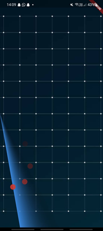

# Mobile Radar System

## Overview
The **Mobile Radar System** is a **Flutter** application designed to visualize radar detections in real time. It integrates with an external **ESP8266-based radar system**, fetching data over a network and displaying detected objects dynamically. The app provides a sweeping radar animation, updating positions based on incoming sensor data.

## Application Screenshot
Below is an image of the Mobile Radar System interface:




## Features
- **Real-Time Radar Visualization**
- **ESP8266 Network Integration**
- **Dynamic Object Detection & Fading Effect**
- **Custom Radar Line Animation**
- **Smooth UI with Flutter & Dart**

## Technologies Used
- **Flutter (Dart)** for UI Development
- **ESP8266 (Arduino C++)** for radar data acquisition
- **HTTP API** for real-time data fetching
- **AnimationController** for radar line sweeping

## File Structure
```
MobileRadar/
│── lib/
│   ├── radar_screen.dart         # Main UI for radar visualization
│   ├── radar_circle.dart         # Radar object animation logic
│   ├── networking.dart           # Handles API requests to ESP8266
│── arduino/
│   ├── proiect.ino               # ESP8266 Radar Firmware
│── assets/
│   ├── images/radar_image.jpg    # Radar background image
│── README.md  # This file
```

## Installation & Running the Application
### 1. Clone the Repository
```
git clone https://github.com/yourusername/Mobile-Radar.git
cd Mobile-Radar
```

### 2. Install Flutter Dependencies
```
flutter pub get
```

### 3. Upload the Arduino Firmware
- Open `proiect.ino` in **Arduino IDE**
- Connect **ESP8266 or NodeMCU**
- Upload the sketch to the device

### 4. Run the Flutter Application
```
flutter run
```

## How It Works
### **Radar Data Fetching**
- The app sends periodic HTTP requests to `http://192.168.4.1`, retrieving angle and distance data.
- The `networking.dart` class handles network communication with the ESP8266.

### **Radar UI and Object Detection**
- The radar sweeps in **360 degrees**, updating the screen in real time.
- Detected objects appear as **animated circles** and fade over time.
- A **Sweep Gradient** is used for radar beam effects.

### **ESP8266 Integration**
- The ESP8266 reads **ultrasonic sensor data** and calculates distance.
- It transmits JSON responses like:
  ```json
  {
    "angle": 90,
    "distance": 35
  }
  ```
- The app interprets this data and updates the UI accordingly.

## Future Improvements
- **Bluetooth Support** for offline use
- **Multiple Sensor Input Support**
- **Obstacle Mapping** for better visualization


